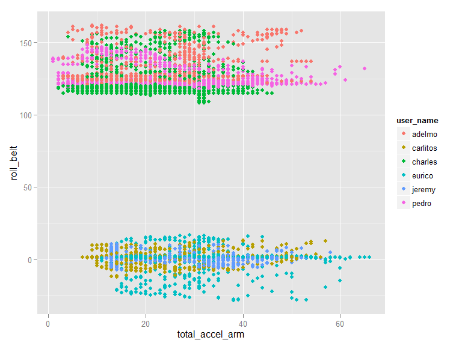

# Practical Machine Learning Course Project
WhitefishDontJump  
June 2015  

The source of data for this project is from

Velloso, E.; Bulling, A.; Gellersen, H.; Ugulino, W.; Fuks, H. **Qualitative Activity Recognition of Weight Lifting Exercises.** Proceedings of 4th International Conference in Cooperation with SIGCHI (Augmented Human '13) . Stuttgart, Germany: ACM SIGCHI, 2013

Read more: http://groupware.les.inf.puc-rio.br/har#ixzz3MCvfqKcP

### Synopsis

#### Exploration, Cleaning and Model Development

1.  Response is categorical (factor with 5 levels, A to E).
2.  The predictors, after cleaning, are entirely integer or numeric, except user_name.
3.  I will retain user_name as a factor variable in initial modelling.  It is possible that individual users uniquely condition the range of responses in other predictors.
4.  I plan to use random forest (via caret's train function), and will use a three fold cross validation of rf results.
5. There are 53 predictor variables after cleaning the raw dataset.  Given the size of the dataset, and selecting 50% of the training set, a 3 fold validation will yield more than 6000 observations per fold, on a base of more than 9800 observations in one half of the training dataset.

#### Results Summary

1. Initial model: Random Forest yielded a highly accurate predictive model (modela) with an estimated out of sample error rate of 1 %. It required 15 minutes to complete execution on my PC and correctly predicted the 20 submission test cases.

2. One further Random Forest model: Modelc (18 predictors based varImp). Modelc ran ~ 10 x faster than Modela, with an estimated out of sample error of 1.4%. Both Modelb and Modelc predicted the 20 submission test cases correctly.

3. I conclude that Modelc, with 18 predictors, provides a better balance of accuracy vs speed that either modela.


--------------------------------------------------------------------------

### Initial Data Cleaning


```r
training <- read.csv("pml-training.csv", na.strings = c("NA", "", "#DIV/0!"))

testing <- read.csv("pml-testing.csv", na.strings = c("NA", "", "#DIV/0!"))

## View(training)

### lots of missing data and/or NAs ##

# I will be removing any columns with NAs as predictors in the training set.

cols2get <- colSums(is.na(training)) == 0
cleantraining <- training[, cols2get]

### leaves 60 columns same cleaning for testing data (optional choice on my
### part)

cols2get2 <- colSums(is.na(testing)) == 0
cleantesting <- testing[, cols2get2]

### remove row 'X', as well as time date window columns which are not related
### to prediction of 'classe'

cleantraining <- cleantraining[, c(2, 8:60)]
cleantesting <- cleantesting[, c(2, 8:60)]
```

### Initial Random Forest Model


```r
require(parallel)
require(doParallel)
mc <- makeCluster(detectCores())
registerDoParallel(mc)

require(caret)


## create new partition in 'training set' and create training1, testing1 set.
## I will use training1 to create the model and testing1 to estimate out of
## sample error.

set.seed(1506)  ## for repeatability

trindex <- as.vector(createDataPartition(cleantraining$classe, p = 0.5, list = FALSE))

training1 <- cleantraining[trindex, ]
testing1 <- cleantraining[-trindex, ]

## Initial model with 1/2 of training set and 3 fold cross validation, using
## the random forest method and caret's train() function.  Afterwards, test
## the model with other half of training set to estimate out of sample
## accuracy.

controla <- trainControl(method = "cv", number = 3, allowParallel = TRUE)

modela <- train(x = training1[, -54], y = training1[, 54], method = "rf", trControl = controla)
```


```r
## determine in sample error, which vars are relevant and relative importance

modela
```

```
## Random Forest 
## 
## 9812 samples
##   53 predictor
##    5 classes: 'A', 'B', 'C', 'D', 'E' 
## 
## No pre-processing
## Resampling: Cross-Validated (3 fold) 
## 
## Summary of sample sizes: 6542, 6541, 6541 
## 
## Resampling results across tuning parameters:
## 
##   mtry  Accuracy   Kappa      Accuracy SD   Kappa SD    
##    2    0.9811455  0.9761422  0.0026002076  0.0032834722
##   27    0.9843049  0.9801388  0.0006383874  0.0008048954
##   53    0.9764574  0.9702080  0.0026116338  0.0033098959
## 
## Accuracy was used to select the optimal model using  the largest value.
## The final value used for the model was mtry = 27.
```

```r
confusionMatrix(modela)  ## in sample error
```

```
## Cross-Validated (3 fold) Confusion Matrix 
## 
## (entries are percentages of table totals)
##  
##           Reference
## Prediction    A    B    C    D    E
##          A 28.4  0.4  0.0  0.0  0.0
##          B  0.0 18.8  0.2  0.0  0.0
##          C  0.0  0.2 17.1  0.3  0.1
##          D  0.0  0.0  0.1 16.0  0.1
##          E  0.0  0.0  0.0  0.0 18.1
```

```r
varImp(modela)
```

```
## rf variable importance
## 
##   only 20 most important variables shown (out of 53)
## 
##                      Overall
## roll_belt            100.000
## pitch_forearm         55.694
## yaw_belt              52.505
## magnet_dumbbell_z     43.121
## pitch_belt            40.507
## magnet_dumbbell_y     40.262
## roll_forearm          38.379
## accel_dumbbell_y      23.028
## roll_dumbbell         18.510
## magnet_dumbbell_x     17.737
## accel_forearm_x       16.404
## magnet_belt_z         14.962
## accel_dumbbell_z      13.161
## total_accel_dumbbell  12.913
## accel_belt_z          12.885
## magnet_forearm_z      12.717
## magnet_belt_y         11.827
## gyros_belt_z          11.823
## yaw_arm               10.310
## magnet_belt_x          9.954
```

```r
## All factor levels of user_name, except Eurico, had relative importance of
## less than 1. Eurico's activity differed from those of the other users: his
## user_name factor level had relative importance of 2.35 on the scaled
## varImp results, compared to 0.54 for Charles, and smaller values for other
## users. I conclude that user_name had minimal importance in the final
## model.


## Out of Sample Error estimate

## I will estimate the out of sample error by applying the model to the
## second part of the training set (named testing1).

predicta <- predict(modela, testing1)

confusionMatrix(predicta, testing1$classe)
```

```
## Confusion Matrix and Statistics
## 
##           Reference
## Prediction    A    B    C    D    E
##          A 2786   24    0    0    0
##          B    0 1866   22    0    3
##          C    3    7 1680   31    3
##          D    0    1    9 1577    2
##          E    1    0    0    0 1795
## 
## Overall Statistics
##                                           
##                Accuracy : 0.9892          
##                  95% CI : (0.9869, 0.9911)
##     No Information Rate : 0.2844          
##     P-Value [Acc > NIR] : < 2.2e-16       
##                                           
##                   Kappa : 0.9863          
##  Mcnemar's Test P-Value : NA              
## 
## Statistics by Class:
## 
##                      Class: A Class: B Class: C Class: D Class: E
## Sensitivity            0.9986   0.9831   0.9819   0.9807   0.9956
## Specificity            0.9966   0.9968   0.9946   0.9985   0.9999
## Pos Pred Value         0.9915   0.9868   0.9745   0.9924   0.9994
## Neg Pred Value         0.9994   0.9960   0.9962   0.9962   0.9990
## Prevalence             0.2844   0.1935   0.1744   0.1639   0.1838
## Detection Rate         0.2840   0.1902   0.1713   0.1608   0.1830
## Detection Prevalence   0.2864   0.1928   0.1757   0.1620   0.1831
## Balanced Accuracy      0.9976   0.9900   0.9882   0.9896   0.9977
```

```r
## fit is very good, accuracy 0.99, and does not seem to be overfitting on
## the testing1 set. I am satisfied with the model result and also believe
## that using the entire training set can only increase the chance of
## overfitting.

## Based on this favorable result, I use this model, 'modela', on the class
## testing set:

answers <- predict(modela, cleantesting)

answers
```

```
##  [1] B A B A A E D B A A B C B A E E A B B B
## Levels: A B C D E
```

```r
## submitting 'answers' (via the function provided), scored 20 of 20 correct.
```

#### Initial Model comments:

The random forest method, properly tuned for 3 fold cross validation and a controlled training set size, created a prediction model with 99% accuracy in an out of sample test.


----------------------------------------------------------------------------


#### What about individual user conditioning the predictors?

Here is a scatter plot of total_accel_arm and roll_belt, colored by user_name to examine the variation across users for one of the most important features in the model, roll_belt (see varImp output, above). Note: The selection of total_accel_arm for the plot was somewhat arbitrary; it isn't very important in the model but it is highly variable for each user, so the resulting plot displays the roll_belt values for better visualization of user differences. 


```r
    qplot(total_accel_arm, roll_belt, data=training1, color = user_name)
```

 

Comments on the plot: Can this model be generalized to predict classe for other users not in the data set? While the plot confirms differences among users, it is not very important in the final model, as reported by varImp(). 

----------------------------------------------------------------------------

### Modelc: Reducing predictors to those with higher importance.

Next, I will test an RF model with the set of predictors reduced to those with scaled importance >= 10, as reported by varImp() under modela.


```r
## Use VarImp to remove lowest importance variables (scaled imp less than
## 10.0), leaving 19 predictors.

importance <- varImp(modela)$importance
importance$vars <- rownames(importance)

importance <- importance[order(importance$Overall, decreasing = TRUE), ]

impCols <- importance[(importance$Overall >= 10), 2]
impCols
```

```
##  [1] "roll_belt"            "pitch_forearm"        "yaw_belt"            
##  [4] "magnet_dumbbell_z"    "pitch_belt"           "magnet_dumbbell_y"   
##  [7] "roll_forearm"         "accel_dumbbell_y"     "roll_dumbbell"       
## [10] "magnet_dumbbell_x"    "accel_forearm_x"      "magnet_belt_z"       
## [13] "accel_dumbbell_z"     "total_accel_dumbbell" "accel_belt_z"        
## [16] "magnet_forearm_z"     "magnet_belt_y"        "gyros_belt_z"        
## [19] "yaw_arm"
```

```r
training2 <- training1[, c(impCols, "classe")]
testing2 <- testing1[, c(impCols, "classe")]

### modelc will use reduced dimensionality

modelc <- train(x = training2[, -20], y = training2[, 20], method = "rf", trControl = controla)

modelc
```

```
## Random Forest 
## 
## 9812 samples
##   19 predictor
##    5 classes: 'A', 'B', 'C', 'D', 'E' 
## 
## No pre-processing
## Resampling: Cross-Validated (3 fold) 
## 
## Summary of sample sizes: 6541, 6542, 6541 
## 
## Resampling results across tuning parameters:
## 
##   mtry  Accuracy   Kappa      Accuracy SD  Kappa SD   
##    2    0.9790052  0.9734341  0.003269658  0.004139831
##   10    0.9776801  0.9717632  0.003528692  0.004462310
##   19    0.9721766  0.9648042  0.003760138  0.004755351
## 
## Accuracy was used to select the optimal model using  the largest value.
## The final value used for the model was mtry = 2.
```

```r
confusionMatrix(modelc)  ## in sample error
```

```
## Cross-Validated (3 fold) Confusion Matrix 
## 
## (entries are percentages of table totals)
##  
##           Reference
## Prediction    A    B    C    D    E
##          A 28.3  0.4  0.0  0.0  0.0
##          B  0.1 18.5  0.3  0.0  0.0
##          C  0.0  0.3 17.0  0.4  0.1
##          D  0.0  0.0  0.1 15.8  0.1
##          E  0.0  0.0  0.0  0.1 18.2
```

```r
## modelc is comparable to modela

predictc <- predict(modelc, testing2)

confusionMatrix(predictc, testing2$classe)
```

```
## Confusion Matrix and Statistics
## 
##           Reference
## Prediction    A    B    C    D    E
##          A 2786   22    0    0    0
##          B    2 1857   27    0    0
##          C    0   17 1673   32    3
##          D    1    2   11 1576    5
##          E    1    0    0    0 1795
## 
## Overall Statistics
##                                           
##                Accuracy : 0.9875          
##                  95% CI : (0.9851, 0.9896)
##     No Information Rate : 0.2844          
##     P-Value [Acc > NIR] : < 2.2e-16       
##                                           
##                   Kappa : 0.9841          
##  Mcnemar's Test P-Value : NA              
## 
## Statistics by Class:
## 
##                      Class: A Class: B Class: C Class: D Class: E
## Sensitivity            0.9986   0.9784   0.9778   0.9801   0.9956
## Specificity            0.9969   0.9963   0.9936   0.9977   0.9999
## Pos Pred Value         0.9922   0.9846   0.9699   0.9881   0.9994
## Neg Pred Value         0.9994   0.9948   0.9953   0.9961   0.9990
## Prevalence             0.2844   0.1935   0.1744   0.1639   0.1838
## Detection Rate         0.2840   0.1893   0.1705   0.1607   0.1830
## Detection Prevalence   0.2862   0.1923   0.1758   0.1626   0.1831
## Balanced Accuracy      0.9977   0.9874   0.9857   0.9889   0.9977
```

```r
answersc <- predict(modelc, cleantesting)

answersc == answers  ## test compare predictions
```

```
##  [1] TRUE TRUE TRUE TRUE TRUE TRUE TRUE TRUE TRUE TRUE TRUE TRUE TRUE TRUE
## [15] TRUE TRUE TRUE TRUE TRUE TRUE
```

modelc loses very little accuracy on test set (compared to modela) and achieves the same results on the course submission test set.  I conclude that the dimension reduction strategy was successful and reduced training time to about 10% of the time required for the original modela.

Thank you for reading and reviewing my work.

--------------------------------------------------------------------------

Here is sessionInfo(), for reference:


```r
print(sessionInfo(), locale = FALSE)
```

```
## R version 3.2.0 (2015-04-16)
## Platform: x86_64-w64-mingw32/x64 (64-bit)
## Running under: Windows 7 x64 (build 7601) Service Pack 1
## 
## attached base packages:
## [1] parallel  stats     graphics  grDevices utils     datasets  methods  
## [8] base     
## 
## other attached packages:
## [1] randomForest_4.6-10 caret_6.0-47        ggplot2_1.0.1      
## [4] lattice_0.20-31     doParallel_1.0.8    iterators_1.0.7    
## [7] foreach_1.4.2      
## 
## loaded via a namespace (and not attached):
##  [1] Rcpp_0.11.6         compiler_3.2.0      formatR_1.2        
##  [4] nloptr_1.0.4        plyr_1.8.2          class_7.3-12       
##  [7] tools_3.2.0         digest_0.6.8        lme4_1.1-7         
## [10] evaluate_0.7        nlme_3.1-120        gtable_0.1.2       
## [13] mgcv_1.8-6          Matrix_1.2-1        yaml_2.1.13        
## [16] brglm_0.5-9         SparseM_1.6         proto_0.3-10       
## [19] e1071_1.6-4         BradleyTerry2_1.0-6 stringr_1.0.0      
## [22] knitr_1.10.5        gtools_3.5.0        grid_3.2.0         
## [25] nnet_7.3-9          rmarkdown_0.6.1     minqa_1.2.4        
## [28] reshape2_1.4.1      car_2.0-25          magrittr_1.5       
## [31] scales_0.2.4        codetools_0.2-11    htmltools_0.2.6    
## [34] MASS_7.3-40         splines_3.2.0       pbkrtest_0.4-2     
## [37] colorspace_1.2-6    labeling_0.3        quantreg_5.11      
## [40] stringi_0.4-1       munsell_0.4.2
```
