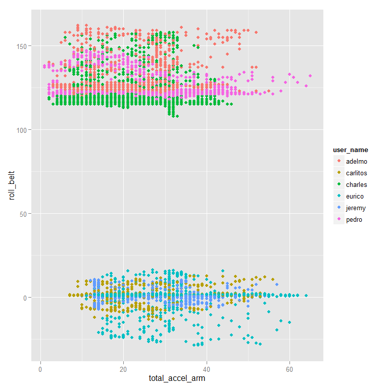

# Practical Machine Learning Course Project
WhitefishDontJump  
March 2015  

The source of data for this project is from

Velloso, E.; Bulling, A.; Gellersen, H.; Ugulino, W.; Fuks, H. **Qualitative Activity Recognition of Weight Lifting Exercises.** Proceedings of 4th International Conference in Cooperation with SIGCHI (Augmented Human '13) . Stuttgart, Germany: ACM SIGCHI, 2013

Read more: http://groupware.les.inf.puc-rio.br/har#ixzz3MCvfqKcP

### Synopsis

#### Exploration, Cleaning and Model Development

1.  Response is categorical (factor with 5 levels, A to E).
2.  The predictors, after cleaning, are entirely integer or numeric, except user_name.
3.  I will retain user_name as a factor variable.  It is possible that individual users uniquely condition the range of responses in other predictors.
4.  I plan to use random forest (via caret's train function), and will use a three fold cross validation of rf results.
5. There are 53 predictor variables after cleaning the raw dataset.  Given the size of the dataset, and selecting 50% of the training set, a 3 fold validation will yield more than 6000 observations per fold, on a base of more than 9800 observations in one half of the training dataset.

#### Results Summary

1. Random Forest yielded a highly accurate predictive model with an estimated out of sample error rate of 1 %.

2. While the response was somewhat conditioned by which user (variable user_name) was measured, the factor user_name had minimal importance in the resulting model.

--------------------------------------------------------------------------


```r
training <- read.csv("pml-training.csv", na.strings = c("NA", "", "#DIV/0!"))

testing <- read.csv("pml-testing.csv", na.strings = c("NA", "", "#DIV/0!"))

## View(training)

### lots of missing data and/or NAs ##

# I will be removing any columns with NAs as predictors in the training set.

cols2get <- colSums(is.na(training)) == 0
cleantraining <- training[, cols2get]

### leaves 60 columns same cleaning for testing data (optional choice on my
### part)

cols2get2 <- colSums(is.na(testing)) == 0
cleantesting <- testing[, cols2get2]

### remove row 'X', as well as time date window columns which are not related
### to prediction of 'classe'

cleantraining <- cleantraining[, c(-1, -3, -4, -5, -6, -7)]
cleantesting <- cleantesting[, c(-1, -3, -4, -5, -6, -7)]
```


```r
require(caret)
require(parallel)

## create new partition in 'training set' and create training1, testing1 set.
## I will use training1 to create the model and testing1 to estimate out of
## sample error.

set.seed(150310)  ## for repeatability

trindex <- as.vector(createDataPartition(cleantraining$classe, p = 0.5, list = FALSE))

training1 <- cleantraining[trindex, ]
testing1 <- cleantraining[-trindex, ]

## Initial model with 1/2 of training set and 3 fold cross validation, using
## the random forest method and caret's train() function.  Afterwards, test
## the model with other half of training set to estimate out of sample
## accuracy.

controla <- trainControl(method = "cv", number = 3, allowParallel = TRUE)

modela <- train(classe ~ ., data = training1, method = "rf", trControl = controla)
```


```r
## determine in sample error, which vars are relevant and relative importance

modela
```

```
## Random Forest 
## 
## 9812 samples
##   53 predictor
##    5 classes: 'A', 'B', 'C', 'D', 'E' 
## 
## No pre-processing
## Resampling: Cross-Validated (3 fold) 
## 
## Summary of sample sizes: 6540, 6542, 6542 
## 
## Resampling results across tuning parameters:
## 
##   mtry  Accuracy   Kappa      Accuracy SD  Kappa SD   
##    2    0.9804318  0.9752386  0.002391992  0.003021179
##   29    0.9835912  0.9792383  0.002743784  0.003467594
##   57    0.9770680  0.9709877  0.006640541  0.008391455
## 
## Accuracy was used to select the optimal model using  the largest value.
## The final value used for the model was mtry = 29.
```

```r
confusionMatrix(modela)  ## in sample error
```

```
## Cross-Validated (3 fold) Confusion Matrix 
## 
## (entries are percentages of table totals)
##  
##           Reference
## Prediction    A    B    C    D    E
##          A 28.4  0.3  0.0  0.0  0.0
##          B  0.0 18.9  0.3  0.0  0.1
##          C  0.0  0.2 17.0  0.4  0.0
##          D  0.0  0.0  0.2 15.9  0.1
##          E  0.0  0.0  0.0  0.0 18.2
```

```r
varImp(modela)
```

```
## rf variable importance
## 
##   only 20 most important variables shown (out of 57)
## 
##                      Overall
## roll_belt             100.00
## pitch_forearm          60.15
## yaw_belt               51.81
## roll_forearm           45.34
## magnet_dumbbell_y      44.04
## magnet_dumbbell_z      43.98
## pitch_belt             42.83
## accel_dumbbell_y       24.69
## accel_forearm_x        19.06
## roll_dumbbell          18.91
## magnet_dumbbell_x      17.18
## accel_belt_z           17.02
## magnet_forearm_z       16.84
## magnet_belt_z          15.77
## accel_dumbbell_z       15.68
## magnet_belt_y          14.50
## total_accel_dumbbell   14.25
## gyros_belt_z           13.20
## magnet_belt_x          11.63
## yaw_arm                11.30
```

```r
## All factor levels of user_name, except Eurico, had relative importance of
## less than 1. Eurico's activity differed from those of the other users: his
## user_name factor level had relative importance of 2.35 on the scaled
## varImp results, compared to 0.54 for Charles, and smaller values for other
## users. I conclude that user_name had minimal importance in the final
## model.


## Out of Sample Error estimate

## I will estimate the out of sample error by applying the model to the
## second part of the training set (named testing1).

predicta <- predict(modela, testing1)

confusionMatrix(predicta, testing1$classe)
```

```
## Confusion Matrix and Statistics
## 
##           Reference
## Prediction    A    B    C    D    E
##          A 2784   15    0    0    0
##          B    5 1870   16    5    2
##          C    1   13 1692   21    8
##          D    0    0    3 1579    7
##          E    0    0    0    3 1786
## 
## Overall Statistics
##                                           
##                Accuracy : 0.9899          
##                  95% CI : (0.9877, 0.9918)
##     No Information Rate : 0.2844          
##     P-Value [Acc > NIR] : < 2.2e-16       
##                                           
##                   Kappa : 0.9872          
##  Mcnemar's Test P-Value : NA              
## 
## Statistics by Class:
## 
##                      Class: A Class: B Class: C Class: D Class: E
## Sensitivity            0.9978   0.9852   0.9889   0.9820   0.9906
## Specificity            0.9979   0.9965   0.9947   0.9988   0.9996
## Pos Pred Value         0.9946   0.9852   0.9752   0.9937   0.9983
## Neg Pred Value         0.9991   0.9965   0.9976   0.9965   0.9979
## Prevalence             0.2844   0.1935   0.1744   0.1639   0.1838
## Detection Rate         0.2838   0.1906   0.1725   0.1610   0.1821
## Detection Prevalence   0.2853   0.1935   0.1769   0.1620   0.1824
## Balanced Accuracy      0.9979   0.9909   0.9918   0.9904   0.9951
```

```r
## fit is very good, accuracy 0.99, and does not seem to be overfitting on
## the testing1 set. I am satisfied with the model result and also believe
## that using the entire training set can only increase the chance of
## overfitting.

## Based on this favorable result, I use this model, 'modela', on the class
## testing set:

answers <- predict(modela, cleantesting)

answers
```

```
##  [1] B A B A A E D B A A B C B A E E A B B B
## Levels: A B C D E
```

```r
## submitting 'answers' (via the function provided), scored 20 of 20 correct.
```

#### Conclusion:

The random forest method, properly tuned for 3 fold cross validation and a controlled training set size, created a prediction model with 99% accuracy in an out of sample test.


#### Supplementary Section: How much do users vary in their response? Does removing user_name as a predictor signifigantly decrease model accuracy?

Here is a scatter plot of total_accel_arm and roll_belt, colored by user_name to examine the variation across users for one of the most important features in the model, roll_belt (see varImp output, above). Note: The selection of total_accel_arm for the plot was somewhat arbitrary; it isn't very important in the model but it is highly variable for each user, so the resulting plot displays the roll_belt values for better visualization of user differences. 


```r
    qplot(total_accel_arm, roll_belt, data=training1, color = user_name)
```

 

Comments on the plot: Can this model be generalized to predict classe for other users not in the data set? While the plot confirms differences among users, it is not very important in the final model, as reported by varImp(). Therefore, it seems likely that the model could have reasonable predictive value on a new user who is not in this data set. 

### Building a model without user_name as predictor

Data prep:  remove user_ name column from previous split data:


```r
training2 <- training1[, -2]  ## remove user_name column
testing2 <- testing1[, -2]

## no need to change controla (train control parameters).  will call new
## model 'modelb'

modelb <- train(classe ~ ., data = training2, method = "rf", trControl = controla)

modelb
```

```
## Random Forest 
## 
## 9812 samples
##   52 predictor
##    5 classes: 'A', 'B', 'C', 'D', 'E' 
## 
## No pre-processing
## Resampling: Cross-Validated (3 fold) 
## 
## Summary of sample sizes: 6542, 6542, 6540 
## 
## Resampling results across tuning parameters:
## 
##   mtry  Accuracy   Kappa      Accuracy SD  Kappa SD   
##    2    0.9794129  0.9739479  0.002170773  0.002753130
##   29    0.9848143  0.9807864  0.002842725  0.003598436
##   56    0.9802279  0.9749820  0.004973892  0.006297055
## 
## Accuracy was used to select the optimal model using  the largest value.
## The final value used for the model was mtry = 29.
```

```r
confusionMatrix(modelb)  ## in sample error
```

```
## Cross-Validated (3 fold) Confusion Matrix 
## 
## (entries are percentages of table totals)
##  
##           Reference
## Prediction    A    B    C    D    E
##          A 28.4  0.3  0.0  0.0  0.0
##          B  0.0 18.8  0.2  0.0  0.0
##          C  0.0  0.2 17.1  0.3  0.1
##          D  0.0  0.0  0.1 16.0  0.1
##          E  0.0  0.0  0.0  0.0 18.2
```

```r
## modelb is comparable to modela

predictb <- predict(modelb, testing2)

confusionMatrix(predictb, testing2$classe)
```

```
## Confusion Matrix and Statistics
## 
##           Reference
## Prediction    A    B    C    D    E
##          A 2787   17    0    0    0
##          B    2 1870   18    1    1
##          C    1   11 1690   23    4
##          D    0    0    2 1583    4
##          E    0    0    1    1 1794
## 
## Overall Statistics
##                                          
##                Accuracy : 0.9912         
##                  95% CI : (0.9892, 0.993)
##     No Information Rate : 0.2844         
##     P-Value [Acc > NIR] : < 2.2e-16      
##                                          
##                   Kappa : 0.9889         
##  Mcnemar's Test P-Value : NA             
## 
## Statistics by Class:
## 
##                      Class: A Class: B Class: C Class: D Class: E
## Sensitivity            0.9989   0.9852   0.9877   0.9845   0.9950
## Specificity            0.9976   0.9972   0.9952   0.9993   0.9998
## Pos Pred Value         0.9939   0.9884   0.9774   0.9962   0.9989
## Neg Pred Value         0.9996   0.9965   0.9974   0.9970   0.9989
## Prevalence             0.2844   0.1935   0.1744   0.1639   0.1838
## Detection Rate         0.2841   0.1906   0.1723   0.1614   0.1829
## Detection Prevalence   0.2858   0.1929   0.1762   0.1620   0.1831
## Balanced Accuracy      0.9983   0.9912   0.9915   0.9919   0.9974
```

```r
answersb <- predict(modelb, cleantesting)

answersb == answers  ## test compare predictions
```

```
##  [1] TRUE TRUE TRUE TRUE TRUE TRUE TRUE TRUE TRUE TRUE TRUE TRUE TRUE TRUE
## [15] TRUE TRUE TRUE TRUE TRUE TRUE
```

While removing user_name as a predictor caused a slight decrease in overall accuracy with the training2 set, it's performance on testing2 and on the submitted test set was excellent.  I conclude that removing user_name from predictors was an acceptable approach to building the predictive model.

Thank you for reading and reviewing my work.

--------------------------------------------------------------------------

Here is sessionInfo(), for reference:


```r
print(sessionInfo(), locale = FALSE)
```

```
## R version 3.1.2 (2014-10-31)
## Platform: x86_64-w64-mingw32/x64 (64-bit)
## 
## attached base packages:
## [1] parallel  stats     graphics  grDevices utils     datasets  methods  
## [8] base     
## 
## other attached packages:
## [1] randomForest_4.6-10 caret_6.0-41        ggplot2_1.0.0      
## [4] lattice_0.20-29    
## 
## loaded via a namespace (and not attached):
##  [1] BradleyTerry2_1.0-5 brglm_0.5-9         car_2.0-22         
##  [4] class_7.3-11        codetools_0.2-10    colorspace_1.2-4   
##  [7] compiler_3.1.2      digest_0.6.8        e1071_1.6-4        
## [10] evaluate_0.5.5      foreach_1.4.2       formatR_1.0        
## [13] grid_3.1.2          gtable_0.1.2        gtools_3.4.1       
## [16] htmltools_0.2.6     iterators_1.0.7     knitr_1.9          
## [19] labeling_0.3        lme4_1.1-7          MASS_7.3-37        
## [22] Matrix_1.1-5        minqa_1.2.4         munsell_0.4.2      
## [25] nlme_3.1-119        nloptr_1.0.4        nnet_7.3-8         
## [28] plyr_1.8.1          proto_0.3-10        Rcpp_0.11.4        
## [31] reshape2_1.4.1      rmarkdown_0.5.1     scales_0.2.4       
## [34] splines_3.1.2       stringr_0.6.2       tools_3.1.2        
## [37] yaml_2.1.13
```

