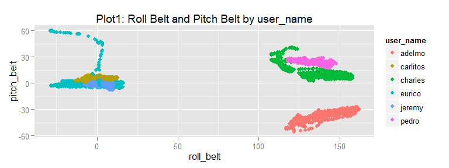
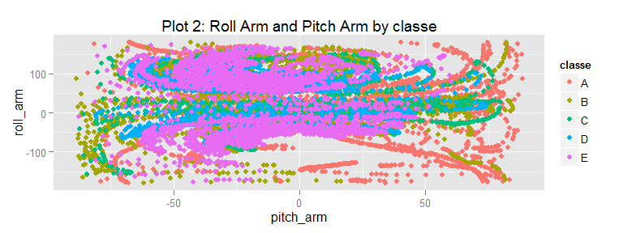
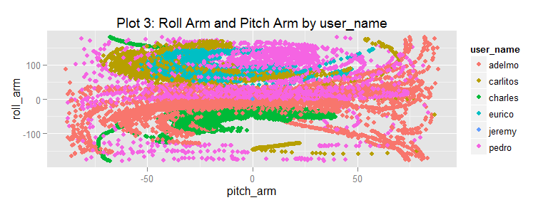
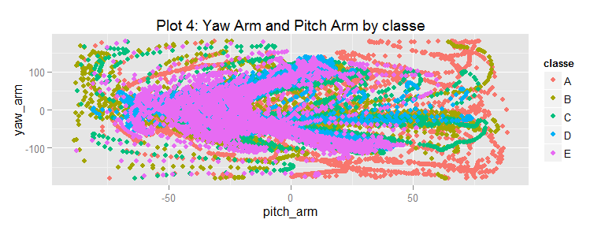
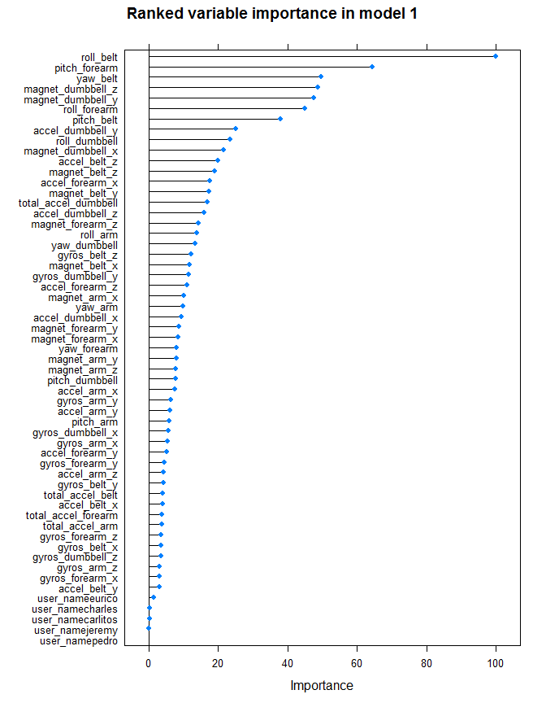

# PML Project: Weight Lifting Activity Recognition
WhitefishDontJump  
June 16, 2015  

The source of data for this project is:

Velloso, E.; Bulling, A.; Gellersen, H.; Ugulino, W.; Fuks, H. **Qualitative Activity Recognition of Weight Lifting Exercises.** Proceedings of 4th International Conference in Cooperation with SIGCHI (Augmented Human '13) . Stuttgart, Germany: ACM SIGCHI, 2013

Read more: http://groupware.les.inf.puc-rio.br/har#ixzz3MCvfqKcP


# Summary

The objective is to predict 'classe', a factor with 5 levels, from the reference data.  The data from JHU/Coursers course is contained in a file 'training.csv', that will be used for building, validating and testing models. The second file 'testing.csv' lacks any classe values and will only be used for the submission test on coursera.

1. Initial cleaning:  Clean data, removing various flavors of NA and columns containing values that are not relevant to current project to correctly predict classe variable.

2. Initial rough model on 20% of 'training' set, using randomForest() with 3-fold cross-validation, with chief purpose to determine relative importance of features.

3. Second model: use a reduced set of predictors, based on varImp(), applying randomForest with 3-fold CV to 50% of data. Examine results and initial "out of bag" errors.

4. Perform additional validation by predicting and evaluating second model accuracy against remaining 30% of data from 'training' set.

5. Predict 20 cases for the submission portion of project and report results.


***Summary Results***
The second model, a 24 predictor Random Forest, achieved 99% accuracy on an out of sample test and scored 20 of 20 correct on the course submission test.

# Data Cleaning & Exploration

## Data Cleaning


```r
# To measure the time efficiency of the knitting and modeling, there are six
# points in the code where I use Sys.time() to quickly capture a time stamp.
# This is done for the total time from this chunk to the last chunk, as well
# as for each model.

startknit <- Sys.time()  ## start time, see end of report total time

sourceData <- read.csv("pml-training.csv", na.strings = c("NA", "", "#DIV/0!"))

submitTestSet <- read.csv("pml-testing.csv", na.strings = c("NA", "", "#DIV/0!"))
# View(sourceData)

# remove NA columns both sets
cols2get <- colSums(is.na(sourceData)) == 0
cols2get2 <- colSums(is.na(submitTestSet)) == 0
cleanData <- sourceData[, cols2get]
cleanSubmit <- submitTestSet[, cols2get2]

## View(cleanData)

# remove row 'X', as well as time date window columns which are not related
# to prediction of 'classe'. will leave 'user_name' in the set - it may or
# may not be relevant/important in the model.

cleanData <- cleanData[, c(2, 8:60)]
cleanSubmit <- cleanSubmit[, c(2, 8:60)]
```

## Data Exploration

Based on cursory examination of the first few columns of the data with exploratory plots, it is evident that several may be important predictors.
Note: these are a small sample of plots that were done and the code for all plots is printed in the Appendix.

    

Comments about plots 1-4: In plot 1, the differences between users are clear, so I will retain user_name as a feature in the initial rough model. In plot 2, it appears that classe may be more responsive to the absolute values and a non-linear relationship between the two variables. Plot 3, like plot 1, shows differences by user_name. In plot 4, there is some separation of classes D and E, together, from the other classes.

# Modeling

## Pre-modeling (partitions and train control)


```r
      require(parallel)  
      require(doParallel)  # parallel with 2 cores reduced runtime ~30%.
      mc <- makeCluster(detectCores())
      registerDoParallel(mc)

      require(caret)
      
# create 3 data partitions: 20% initial model(trainset1), 50% second model(trainset2), 30% validation(validset)
      
      set.seed(616) # for repeatability
      
      trndx20 <- createDataPartition(cleanData$classe,
                                     p = 0.2, list = FALSE)
       
      trainset1 <- cleanData[trndx20,] # contains 20 % of rows
      tempset1 <- cleanData[-trndx20,] # contains 80 % of rows
       
      trndx50 <- createDataPartition(tempset1$classe,
                                     p = (0.5/0.8), list = FALSE)

      trainset2 <- tempset1[trndx50,] # contains 50% of original rows
      validset <- tempset1[-trndx50,] # contains 30% of original rows
      
# common train control parameters will be used on all train() . . .
      
      controla <- trainControl(method="cv", 
                             number = 3, 
                             allowParallel = TRUE)
```

## Initial Random Forest Model, all predictors, 20% of observations


```r
      start1 <- Sys.time()
      
      model1 <- train(classe~.,data=trainset1, 
                    method="rf",
                    trControl = controla)
      
      round(Sys.time() - start1,2) # elapsed time for model1
```

```
## Time difference of 2.67 mins
```

```r
      model1
```

```
## Random Forest 
## 
## 3927 samples
##   53 predictor
##    5 classes: 'A', 'B', 'C', 'D', 'E' 
## 
## No pre-processing
## Resampling: Cross-Validated (3 fold) 
## 
## Summary of sample sizes: 2618, 2619, 2617 
## 
## Resampling results across tuning parameters:
## 
##   mtry  Accuracy   Kappa      Accuracy SD  Kappa SD  
##    2    0.9546695  0.9426237  0.008263507  0.01043963
##   29    0.9595052  0.9487639  0.011490068  0.01455429
##   57    0.9528830  0.9403719  0.014659719  0.01858039
## 
## Accuracy was used to select the optimal model using  the largest value.
## The final value used for the model was mtry = 29.
```

```r
      confusionMatrix(model1) # out of bag error
```

```
## Cross-Validated (3 fold) Confusion Matrix 
## 
## (entries are percentages of table totals)
##  
##           Reference
## Prediction    A    B    C    D    E
##          A 28.0  0.7  0.0  0.0  0.0
##          B  0.3 18.1  0.7  0.1  0.1
##          C  0.1  0.5 16.5  0.7  0.3
##          D  0.0  0.1  0.2 15.6  0.2
##          E  0.0  0.0  0.0  0.0 17.7
```

```r
      varImp(model1)
```

```
## rf variable importance
## 
##   only 20 most important variables shown (out of 57)
## 
##                      Overall
## roll_belt             100.00
## pitch_forearm          64.27
## yaw_belt               49.56
## magnet_dumbbell_z      48.74
## magnet_dumbbell_y      47.58
## roll_forearm           45.08
## pitch_belt             37.94
## accel_dumbbell_y       25.09
## roll_dumbbell          23.56
## magnet_dumbbell_x      21.67
## accel_belt_z           19.89
## magnet_belt_z          18.98
## accel_forearm_x        17.66
## magnet_belt_y          17.38
## total_accel_dumbbell   16.82
## accel_dumbbell_z       15.96
## magnet_forearm_z       14.26
## roll_arm               13.85
## yaw_dumbbell           13.49
## gyros_belt_z           12.22
```


 

Given model1 ~95% accuracy (confusionMatrix), I will use the varImp() results from model1 to reduce the feature set and run a second model on the 50% partition named 'trainset2'.


## Model 2:  Random Forest on 50% partition with reduced feature list


```r
# reduce feature set
      
      importance <- varImp(model1)$importance # get varImp()
      importance$vars <- rownames(importance) 
      importance <- importance[order(importance$Overall, 
                                     decreasing=TRUE),]
      impCols <- importance[(importance$Overall >= 10.0),2] # subset
      
      impCols
```

```
##  [1] "roll_belt"            "pitch_forearm"        "yaw_belt"            
##  [4] "magnet_dumbbell_z"    "magnet_dumbbell_y"    "roll_forearm"        
##  [7] "pitch_belt"           "accel_dumbbell_y"     "roll_dumbbell"       
## [10] "magnet_dumbbell_x"    "accel_belt_z"         "magnet_belt_z"       
## [13] "accel_forearm_x"      "magnet_belt_y"        "total_accel_dumbbell"
## [16] "accel_dumbbell_z"     "magnet_forearm_z"     "roll_arm"            
## [19] "yaw_dumbbell"         "gyros_belt_z"         "magnet_belt_x"       
## [22] "gyros_dumbbell_y"     "accel_forearm_z"      "magnet_arm_x"
```

```r
# create second model
      
      trainset2 <- trainset2[,c(impCols,"classe")]
      
      start2 <- Sys.time()
      
      model2 <- train(classe~.,data=trainset2, 
                    method="rf", 
                    trControl = controla)
      
      round(Sys.time()-start2,2) ## model2 elapsed time
```

```
## Time difference of 3.33 mins
```

```r
      model2
```

```
## Random Forest 
## 
## 9812 samples
##   24 predictor
##    5 classes: 'A', 'B', 'C', 'D', 'E' 
## 
## No pre-processing
## Resampling: Cross-Validated (3 fold) 
## 
## Summary of sample sizes: 6541, 6541, 6542 
## 
## Resampling results across tuning parameters:
## 
##   mtry  Accuracy   Kappa      Accuracy SD   Kappa SD    
##    2    0.9824705  0.9778250  0.0025999893  0.0032856679
##   13    0.9805341  0.9753784  0.0006340846  0.0007939666
##   24    0.9735018  0.9664825  0.0026002555  0.0032814745
## 
## Accuracy was used to select the optimal model using  the largest value.
## The final value used for the model was mtry = 2.
```

```r
      confusionMatrix(model2)
```

```
## Cross-Validated (3 fold) Confusion Matrix 
## 
## (entries are percentages of table totals)
##  
##           Reference
## Prediction    A    B    C    D    E
##          A 28.2  0.3  0.0  0.0  0.0
##          B  0.1 18.8  0.2  0.0  0.0
##          C  0.0  0.3 17.1  0.4  0.0
##          D  0.0  0.0  0.1 15.9  0.1
##          E  0.0  0.0  0.0  0.0 18.3
```

```r
# validation of model 2 on balance of data
      
      validate <- predict(model2,validset)
      confusionMatrix(validate,validset$classe)
```

```
## Confusion Matrix and Statistics
## 
##           Reference
## Prediction    A    B    C    D    E
##          A 1671   10    0    0    0
##          B    3 1119    8    0    1
##          C    0    9 1015   17    3
##          D    0    0    2  947    1
##          E    0    0    1    0 1076
## 
## Overall Statistics
##                                           
##                Accuracy : 0.9907          
##                  95% CI : (0.9878, 0.9929)
##     No Information Rate : 0.2845          
##     P-Value [Acc > NIR] : < 2.2e-16       
##                                           
##                   Kappa : 0.9882          
##  Mcnemar's Test P-Value : NA              
## 
## Statistics by Class:
## 
##                      Class: A Class: B Class: C Class: D Class: E
## Sensitivity            0.9982   0.9833   0.9893   0.9824   0.9954
## Specificity            0.9976   0.9975   0.9940   0.9994   0.9998
## Pos Pred Value         0.9941   0.9894   0.9722   0.9968   0.9991
## Neg Pred Value         0.9993   0.9960   0.9977   0.9966   0.9990
## Prevalence             0.2845   0.1934   0.1744   0.1639   0.1837
## Detection Rate         0.2840   0.1902   0.1725   0.1610   0.1829
## Detection Prevalence   0.2857   0.1922   0.1775   0.1615   0.1831
## Balanced Accuracy      0.9979   0.9904   0.9917   0.9909   0.9976
```

Model 2, a 3 fold cross validated Random Forest, using 1/2 of the data, was validated, with 99% accuracy on an out of sample test, using 30% of the data.
This model used 24 variables as features which are listed earlier in the report as 'ImpCols'.

## Submission Test


```r
      answer20 <- predict(model2,cleanSubmit)
      answer20
```

```
##  [1] B A B A A E D B A A B C B A E E A B B B
## Levels: A B C D E
```

```r
# the results were submitted via Coursera web and scored 20 of 20 correct.
```


# Appendix

This appendix has:

1. code for plots.

2. hardware & session information for reproducibility.

3. total elapsed time to knit the RMD, including all models, text and charts.

## Plot Code


```r
      require(ggplot2)

      qplot(roll_belt,pitch_belt, data=cleanData, color = user_name,
            main="Plot1: Roll Belt and Pitch Belt by user_name")

      qplot(pitch_arm,roll_arm, data=cleanData, color = classe,
            main="Plot 2: Roll Arm and Pitch Arm by classe")
      
      qplot(pitch_arm,roll_arm, data=cleanData, color = user_name,
            main="Plot 3: Roll Arm and Pitch Arm by user_name")
      
      qplot(pitch_arm,yaw_arm, data=cleanData, color = classe,
            main="Plot 4: Yaw Arm and Pitch Arm by classe")
      
      

# the following plots were not run for the report

#      boxplot(roll_belt~classe,data=cleanData, main="Roll Belt by Classe")
#      boxplot(pitch_belt~classe,data=cleanData, main="Pitch Belt by Classe")
#      boxplot(yaw_belt~classe,data=cleanData, main="Yaw Belt by Classe")
                  
#      qplot(yaw_arm,roll_arm, data=cleanData, color = classe,
#            main="Roll Arm and Yaw Arm by classe")
         
#      qplot(roll_belt,pitch_belt, data=cleanData, color = classe,
#           main="Roll and Pitch Belt by classe")
      
#      qplot(roll_belt,yaw_belt, data=cleanData, color = classe,
#            main="Roll and Yaw Belt by classe")
      
#      qplot(yaw_belt,pitch_belt, data=cleanData, color = classe,
#            main="Yaw Belt and Pitch Belt by classe")
```


```r
        plot(varImp(model1), main="Ranked variable importance in model 1")
```


## Session Info and Elapsed Time

My hardware: Pentium duo 1.8 Ghz, 3 GB DDR2 ram. HP/Compaq C700.


```r
      sessionInfo()  
```

```
## R version 3.2.0 (2015-04-16)
## Platform: x86_64-w64-mingw32/x64 (64-bit)
## Running under: Windows 7 x64 (build 7601) Service Pack 1
## 
## locale:
## [1] LC_COLLATE=English_United States.1252 
## [2] LC_CTYPE=English_United States.1252   
## [3] LC_MONETARY=English_United States.1252
## [4] LC_NUMERIC=C                          
## [5] LC_TIME=English_United States.1252    
## 
## attached base packages:
## [1] parallel  stats     graphics  grDevices utils     datasets  methods  
## [8] base     
## 
## other attached packages:
## [1] randomForest_4.6-10 caret_6.0-47        lattice_0.20-31    
## [4] doParallel_1.0.8    iterators_1.0.7     foreach_1.4.2      
## [7] ggplot2_1.0.1      
## 
## loaded via a namespace (and not attached):
##  [1] Rcpp_0.11.6         compiler_3.2.0      formatR_1.2        
##  [4] nloptr_1.0.4        plyr_1.8.3          class_7.3-12       
##  [7] tools_3.2.0         digest_0.6.8        lme4_1.1-7         
## [10] evaluate_0.7        gtable_0.1.2        nlme_3.1-120       
## [13] mgcv_1.8-6          Matrix_1.2-1        yaml_2.1.13        
## [16] SparseM_1.6         brglm_0.5-9         proto_0.3-10       
## [19] e1071_1.6-4         BradleyTerry2_1.0-6 stringr_1.0.0      
## [22] knitr_1.10.5        gtools_3.5.0        grid_3.2.0         
## [25] nnet_7.3-9          rmarkdown_0.7       minqa_1.2.4        
## [28] reshape2_1.4.1      car_2.0-25          magrittr_1.5       
## [31] scales_0.2.5        codetools_0.2-11    htmltools_0.2.6    
## [34] MASS_7.3-40         splines_3.2.0       pbkrtest_0.4-2     
## [37] colorspace_1.2-6    quantreg_5.11       labeling_0.3       
## [40] stringi_0.4-1       munsell_0.4.2
```

```r
      round(Sys.time() - startknit,2)  ## time to knit from first chunk to last
```

```
## Time difference of 6.37 mins
```

---
end of report.  Thank you for your review and feedback.
